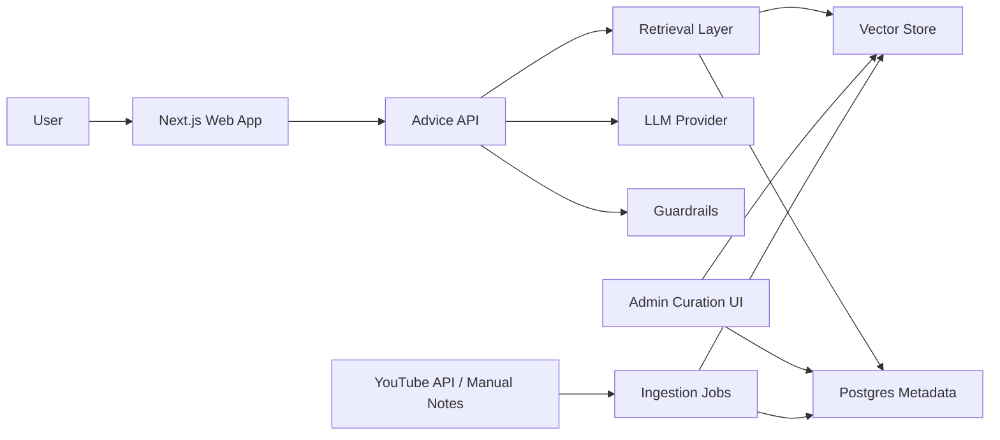

# Hey Mark: AI 마케팅 조언 서비스 구현 계획

## 1. 목표

`Hey Mark`는 먼저 카페 사장이 실제로 쓸 수 있는 마케팅 조언 서비스로 좁혀 시작한다. 사용자는 지역, 주변 상권, 인구/연령층, 카페 규모, 대표 메뉴, 오픈 상태, 인스타그램 아이디, 네이버지도 정보, 블로그 글, 현재 고민을 입력하고 다음 결과를 받는다.

- 카페 현재 상황 진단
- 지역/시간대/메뉴 기반 방문 명분 설계
- 14일 단위 실행 계획
- 네이버지도/리뷰/블로그/인스타그램 운영 방향
- 오퍼와 카피 예시
- 측정 지표와 다음에 수집할 데이터

핵심은 “마케팅 영상을 모델에 그냥 학습시킨 AI”가 아니라, 공개 또는 허가된 자료를 구조화한 지식베이스를 만들고 답변마다 근거를 추적할 수 있게 하는 것이다.

현재 MVP는 곽팀장 YouTube 영상을 아직 학습하거나 RAG 지식베이스로 구축하지 않았다. 임시 카페 전략 카드와 사용자가 입력한 카페 상황을 기준으로 답변한다. 제품 화면에서도 이 상태를 명확히 표시해야 한다.

## 2. 중요한 전제

대상 채널은 공개 페이지 기준 `@marketing0`, `곽팀장 - YouTube`로 확인했다.

YouTube 콘텐츠는 신중히 다뤄야 한다. YouTube 약관은 명시적으로 허용되거나 권리자 허가가 있는 경우가 아니면 콘텐츠를 다운로드, 재배포, 독립적으로 재사용하는 행위를 제한한다. YouTube Data API는 caption 리소스에 대해 `list`, `download` 같은 메서드를 제공하지만, 실제 구현에서는 권한, 쿼터, 이용약관, 권리자 허가를 확인해야 한다.

따라서 1차 구현은 다음 원칙을 따른다.

- 영상 원본 다운로드 금지
- 무단 transcript scraping 금지
- 모델 파인튜닝보다 RAG 우선
- 출처 URL, 영상 ID, 구간, 요약 근거 저장
- 필요 시 채널 운영자에게 명시적 사용 허가 요청
- 허가 전에는 직접 작성한 요약/분류/인사이트와 공개 메타데이터 중심으로 시작

참고:

- YouTube 채널: https://www.youtube.com/@marketing0
- YouTube Terms of Service: https://www.youtube.com/t/terms
- YouTube API Services Terms: https://developers.google.com/youtube/terms/api-services-terms-of-service
- YouTube Data API captions docs: https://developers.google.com/youtube/v3/docs/captions

## 3. 서비스 제공 방식

### 추천 MVP: 카페 사장용 전략 코치

가장 가볍고 빠른 제공 방식은 웹 기반 카페 브리프 입력 서비스다.

사용 흐름:

1. 사용자가 지역, 주변 환경, 주요 고객, 메뉴, 오픈 상태, 온라인 정보, 현재 문제를 입력한다.
2. 서비스가 가오픈 반응, 재방문율, 시간대, 메뉴, 온라인 채널 상태를 신호로 해석한다.
3. 허가/검수된 지식베이스가 있으면 관련 마케팅 원칙을 검색한다.
4. 현재 지식베이스가 없으면 임시 카페 전략 카드와 입력 맥락 기준임을 표시한다.
5. 답변은 플레이북, 오퍼, 카피, 14일 실행계획, 측정 지표로 제공한다.

첫 화면은 랜딩 페이지가 아니라 바로 작업 화면이어야 한다.

기본 입력 필드:

- `cafe_name`: 카페명
- `region`: 지역/상권
- `nearby_context`: 주변 시설, 유동 인구, 주거/학교/회사 여부
- `population_notes`: 가오픈/행사/방문 인구 힌트
- `age_groups`: 주요 연령층
- `cafe_size`: 좌석 수, 매장 규모
- `signature_menu`: 대표 메뉴
- `instagram_handle`: 인스타그램 아이디
- `naver_map_url`: 네이버지도 정보
- `blog_urls`: 관련 블로그 글
- `promo_history`: 이전 행사와 반응
- `repeat_rate`: 재방문율
- `current_problem`: 현재 가장 막히는 점

기본 출력 형식:

- 한 줄 진단
- 전략 해석
- 지금 할 결정
- 마케팅 플레이 3개
- 오퍼와 카피 예시
- 14일 실행 플랜
- 측정 지표
- 더 있으면 좋은 데이터
- 지식베이스/외부 분석 상태
- 참고 근거

### 추가 제공 방식

초기에는 하나의 웹앱으로 시작하고, 사용성이 검증되면 아래를 추가한다.

- Chrome extension: 경쟁사 페이지나 광고를 보며 즉시 분석
- Slack/Discord bot: 팀 내부 마케팅 브레인스토밍
- Notion export: 캠페인 기획서 자동 저장
- PDF report: 클라이언트 제안서 초안 생성
- API: 대행사나 SaaS가 자체 화면에 붙일 수 있는 조언 엔진

## 4. 지식베이스 설계

### 왜 파인튜닝보다 RAG인가

마케팅 영상 지식은 업데이트가 필요하고, 출처 검증이 중요하다. 파인튜닝은 답변 근거를 추적하기 어렵고, 저작권/약관 리스크도 커진다. 반면 RAG는 어떤 영상, 어떤 요약, 어떤 프레임워크를 근거로 답했는지 남길 수 있다.

권장 구조:

- `Raw Source`: 영상 URL, 제목, 설명, 공개 메타데이터
- `Transcript or Notes`: 허가된 transcript 또는 직접 작성한 시청 노트
- `Atomic Insight`: 하나의 마케팅 원칙이나 사례 단위로 쪼갠 지식
- `Framework`: STP, AIDA, Hook-Problem-Solution, Offer Stack 등 구조화된 템플릿
- `Industry Mapping`: 업종별로 어떤 인사이트가 잘 맞는지 태깅
- `Evidence`: 출처, 작성자, 영상 ID, 타임스탬프, 권리 상태

### 데이터 수집 단계

1. `Allowed Metadata Ingestion`
   - YouTube Data API로 채널/영상 메타데이터 수집
   - 제목, 설명, 게시일, URL, 썸네일, 태그 가능 범위 저장

2. `Permissioned Transcript Ingestion`
   - 채널 운영자 허가가 있거나 공식 API/권한으로 접근 가능한 caption만 사용
   - 자동 자막은 오류가 많으므로 사람이 검수한 요약을 우선

3. `Manual Knowledge Curation`
   - 핵심 영상부터 사람이 보고 요약
   - “주장”, “사례”, “적용 조건”, “주의점”, “산업 적합도”로 구조화

4. `Insight Normalization`
   - 긴 요약을 300-800자 단위의 독립 지식으로 분해
   - 각 지식에 태그 부여

5. `Embedding and Retrieval`
   - atomic insight를 벡터화
   - 사용자 상황과 가장 가까운 지식 검색
   - BM25/키워드 검색과 벡터 검색을 혼합

6. `Answer Generation`
   - 검색된 근거만 사용해 제안
   - 근거가 부족하면 “추가 정보 필요” 또는 “일반 원칙 기반”이라고 표시

### 지식 스키마 예시

```json
{
  "id": "insight_0001",
  "source_type": "youtube_video_note",
  "source_url": "https://www.youtube.com/watch?v=...",
  "source_channel": "@marketing0",
  "rights_status": "manual_note_from_public_viewing",
  "title": "Offer clarity before ad scaling",
  "summary": "광고비를 늘리기 전에 고객이 즉시 이해할 수 있는 제안 구조를 먼저 점검해야 한다.",
  "principle": "Offer > Creative > Media buying",
  "applicable_industries": ["ecommerce", "local_service", "education"],
  "funnel_stage": "conversion",
  "confidence": 0.8,
  "created_by": "curator",
  "review_status": "reviewed"
}
```

## 5. 산업별 대응 방식

산업별로 완전히 다른 AI를 만들 필요는 없다. 공통 마케팅 엔진 위에 산업 프로파일과 제약 조건을 얹는다.

### 산업 프로파일

각 산업은 다음 필드를 가진다.

- 고객 구매 주기
- 의사결정자와 사용자 분리 여부
- 평균 객단가
- 신뢰 형성 방식
- 주요 채널
- 금지/주의 표현
- 자주 쓰는 제안 구조
- 전환 지표
- 대표 콘텐츠 포맷

### 1차 지원 산업

초기에는 너무 넓히지 말고 아래 6개만 지원한다. 카페는 필수 지원 산업으로 둔다.

| 산업 | 주요 고민 | 추천 출력 |
| --- | --- | --- |
| 카페 | 평일 방문, 메뉴 인지도, 재방문 | 시그니처 메뉴 캠페인, 지도/리뷰 전략, 시간대별 오퍼 |
| 이커머스 | 상세페이지, 광고 전환, 재구매 | 후킹 카피, 오퍼 설계, 소재 테스트 |
| B2B SaaS | 리드, 신뢰, 긴 세일즈 사이클 | ICP 정의, 웨비나/백서, 세일즈 메시지 |
| 교육/강의 | 전문성, 후기, 상담 전환 | 커리큘럼 포지셔닝, 상담 스크립트 |
| 병원/웰니스 | 신뢰, 규제, 지역성 | 조심스러운 표현, FAQ, 후기 기반 콘텐츠 |
| 크리에이터/개인브랜드 | 차별화, 콘텐츠 지속성 | 콘텐츠 축, 시리즈 기획, 팬 전환 |

### 산업별 답변 제어

답변 생성 전에 다음 순서로 컨텍스트를 구성한다.

1. 사용자 입력
2. 산업 프로파일
3. 관련 마케팅 지식
4. 채널별 제약
5. 출력 템플릿

예를 들어 병원/웰니스는 공격적인 효능 단정 문구를 피하고, B2B SaaS는 즉시 구매 유도보다 신뢰 자산과 리드 전환을 우선한다.

## 6. 추천 기술 아키텍처

가볍게 시작하려면 모노레포보다 단일 Next.js 앱이 낫다. API, UI, admin, cron을 한 저장소에서 관리한다.



### 권장 스택

- Frontend/API: Next.js + TypeScript
- Styling: Tailwind CSS + shadcn/ui
- Database: Supabase Postgres
- Vector search: pgvector
- Auth: Supabase Auth 또는 Clerk
- Background jobs: Inngest 또는 Supabase Edge Functions
- LLM: provider adapter 패턴으로 추상화
- Observability: PostHog + Sentry
- Deployment: Vercel

처음부터 LangChain 같은 무거운 프레임워크를 필수로 두지 않는다. 검색, 프롬프트 조립, 응답 검증은 작은 내부 모듈로 시작하고, 복잡도가 커질 때 교체한다.

## 7. 주요 기능 범위

### MVP

- 채팅형 마케팅 조언
- 업종/목표/예산 기반 브리프 입력
- RAG 기반 지식 검색
- 답변 내 근거 표시
- 산업별 출력 템플릿 6개
- 관리자용 지식 입력/검수 화면
- 대화 저장과 즐겨찾기

### V1

- 콘텐츠 캘린더 생성
- 광고 카피 A/B 변형
- 상세페이지/랜딩페이지 진단
- 경쟁사 URL 분석
- Notion/PDF export
- 팀 워크스페이스

### V2

- 산업별 벤치마크 데이터
- 캠페인 성과 데이터 업로드
- CRM/광고 플랫폼 연동
- 개인화된 브랜드 톤 학습
- 대행사용 클라이언트별 워크스페이스

## 8. 프롬프트 및 응답 정책

AI 답변은 다음 규칙을 따른다.

- 먼저 사용자의 상황을 1문장으로 재정의한다.
- 근거가 있는 제안과 일반 추론을 구분한다.
- 추상 조언보다 실행 단위로 쓴다.
- 예산이 낮으면 유료 광고보다 메시지/오퍼/콘텐츠 실험을 우선한다.
- 산업 규제가 있는 분야는 보수적으로 답한다.
- 확실하지 않은 지식은 확신도 낮게 표시한다.

응답 템플릿:

```md
## 진단
...

## 가장 먼저 바꿀 것
1. ...
2. ...
3. ...

## 실행안
...

## 카피 예시
...

## 측정 지표
...

## 참고 근거
- ...
```

## 9. GitHub repo 구조

추천 repo 이름은 `hey-mark`다.

```text
hey-mark/
  README.md
  docs/
    marketing-ai-service-plan.md
    data-policy.md
    product-requirements.md
    prompt-contracts.md
  src/
    app/
      page.tsx
      api/
        advice/
          route.ts
    components/
    features/
      advice/
      knowledge/
      industries/
    lib/
      llm/
      retrieval/
      prompts/
      youtube/
      db/
  supabase/
    migrations/
    seed/
  scripts/
    ingest-youtube-metadata.ts
    normalize-insights.ts
    backfill-embeddings.ts
  tests/
    unit/
    integration/
  .github/
    workflows/
      ci.yml
```

초기 GitHub 생성 절차:

```bash
gh repo create hey-mark --private --source=. --remote=origin
git add .
git commit -m "docs: add initial marketing AI service plan"
git push -u origin main
```

실제 원격 repo 생성은 공개/비공개 여부, GitHub organization, 라이선스, 시크릿 관리 방식을 확인한 뒤 실행하는 것이 좋다.

## 10. 구현 단계

### Phase 0: 검증 준비

기간: 1-2일

- repo 생성
- 제품명, 대상 고객, 가격 가설 정리
- YouTube 콘텐츠 사용 정책 문서 작성
- 채널 운영자 허가가 필요한 범위 정의

완료 기준:

- `docs/data-policy.md`
- `docs/product-requirements.md`
- 초기 issue backlog

### Phase 1: 지식베이스 MVP

기간: 3-5일

- 영상 메타데이터 저장 테이블 생성
- 수동 지식 입력 스키마 생성
- atomic insight CRUD 구현
- 태그 체계 정의
- embedding 생성 job 구현

완료 기준:

- 관리자 화면에서 지식을 입력하고 검색 가능
- 최소 30개 atomic insight 등록

### Phase 2: 조언 엔진 MVP

기간: 5-7일

- 사용자 브리프 폼
- retrieval layer 구현
- 산업 프로파일 6개 작성
- 답변 템플릿 구현
- 근거 표시

완료 기준:

- 6개 산업에서 일관된 마케팅 조언 생성
- 답변마다 참조 근거 2개 이상 표시

### Phase 3: 사용자 경험 개선

기간: 3-5일

- 대화 저장
- 즐겨찾기
- 카피 변형 생성
- 7일 실행 플랜
- PDF/Markdown export

완료 기준:

- 사용자가 하나의 브리프에서 기획안을 저장/export 가능

### Phase 4: 신뢰성과 운영

기간: 3-5일

- hallucination 방지 체크
- 금지 표현 필터
- 비용/토큰 사용량 로깅
- Sentry/PostHog 연동
- 평가 데이터셋 작성

완료 기준:

- 주요 요청 30개에 대해 수동 평가 통과
- 비용과 실패율 확인 가능

## 11. 평가 기준

기능보다 “쓸 만한 조언인가”를 먼저 봐야 한다.

평가 항목:

- 구체성: 바로 실행할 수 있는가
- 맥락 적합성: 업종/예산/목표를 반영하는가
- 창의성: 뻔한 말 이상의 각도가 있는가
- 근거성: 어떤 지식에서 나온 제안인지 보이는가
- 안전성: 과장, 규제 위반, 저작권 리스크가 없는가
- 가벼움: 사용자가 2분 안에 첫 답을 받을 수 있는가

초기 테스트셋:

- 카페 평일 저녁 방문 유도
- 여성 의류 쇼핑몰 재구매 캠페인
- B2B SaaS 리드 확보
- 온라인 강의 첫 판매
- 피부과 신규 고객 상담 전환
- 1인 컨설턴트 개인브랜드 콘텐츠

## 12. 리스크와 대응

| 리스크 | 대응 |
| --- | --- |
| YouTube 콘텐츠 무단 사용 | 허가된 API/수동 노트/RAG/출처 표시 중심으로 설계 |
| 자동 자막 오류 | 사람이 검수한 atomic insight만 고신뢰 지식으로 승격 |
| 일반론만 반복 | 산업 프로파일과 사용자 브리프 필수화 |
| 과도한 구현 범위 | 채팅형 MVP와 관리자 지식 입력부터 시작 |
| LLM hallucination | 검색 근거 없는 주장은 낮은 확신 또는 추가 질문으로 처리 |
| 산업 규제 | 산업별 금지 표현과 보수적 템플릿 적용 |

## 13. 우선순위 결론

가장 현실적인 시작점은 다음이다.

1. `hey-mark` GitHub repo를 private으로 만든다.
2. Next.js + Supabase + pgvector로 단일 앱을 만든다.
3. YouTube 영상은 원본 학습이 아니라 허가/검수된 지식베이스로 변환한다.
4. 처음에는 6개 산업, 30-100개 atomic insight, 채팅형 조언만 제공한다.
5. 사용자가 반복해서 저장/export하는 기능이 보이면 팀/대행사용 기능으로 확장한다.

이 방식이면 법적 리스크를 낮추면서도 “마케팅 지식을 학습한 것처럼 보이는” 실용적 AI 서비스를 빠르게 제공할 수 있다.
